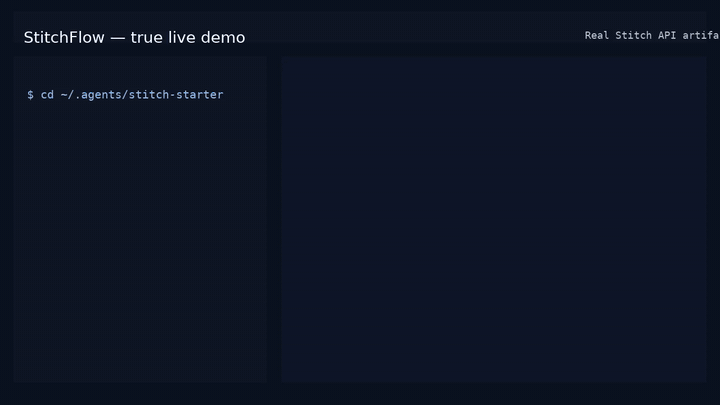

# StitchFlow

[](https://nodejs.org/)
[](https://agentskills.io)
[](https://developers.openai.com/codex/skills)
[](https://code.claude.com/docs/en/slash-commands)
[](https://docs.openclaw.ai/tools/clawhub)
[](https://github.com/github/awesome-copilot)
[](https://google-gemini.github.io/gemini-cli/docs/extensions/)
[](./LICENSE)

Turn product briefs into Google Stitch projects, UI directions, design systems,
HTML handoff artifacts, screenshots, and regression evidence from one portable
agent workflow.

StitchFlow is for teams that want Stitch to stay the design source of truth
while agents handle the repeatable work around it: prompt shaping, variants,
`DESIGN.md`, design-system application, local exports, audits, and release
checks.



## Why Use It

- **One workflow across agent clients**: Codex, Claude Code, OpenClaw, GitHub
  Copilot, Gemini CLI, and clients that understand `SKILL.md` / `AGENTS.md`.
- **Native MCP first, local CLI fallback**: use live Stitch MCP tools when your
  client exposes them; otherwise use the bundled `stitch-starter` toolkit.
- **Local evidence by default**: save HTML, screenshots, `result.json`,
  `variants.json`, export manifests, and audit reports under `runs/`.
- **Design-system coverage**: upload `DESIGN.md`, create/list/update/apply
  Stitch design systems, and regression-test the full design-system path.
- **Handoff checks**: audit required text, unsupported claims, artifact quality,
  responsive overflow, browser errors, and serious accessibility issues.
- **Safe project downloads**: use the SDK downloader when possible and fall back
  to short local paths when long Stitch screen titles hit filesystem limits.

## Requirements

- Node.js `>=22`
- A Google Stitch API key in `STITCH_API_KEY`
- At least one supported agent client or direct CLI usage

Secrets stay local. The installer preserves an existing toolkit `.env`, and the
toolkit `.gitignore` excludes `.env`, `runs/`, and `node_modules/`.

## Install

```bash
git clone https://github.com/yshishenya/stitchflow.git
cd stitchflow
bash install.sh --target all
```

Add your API key:

```text
${STITCH_STARTER_ROOT:-$HOME/.agents/stitch-starter}/.env
```

Then restart your agent client.

Canonical install paths:

| Item | Path |
| --- | --- |
| Skill | `${AGENT_SKILLS_HOME:-$HOME/.agents}/skills/stitchflow` |
| Toolkit | `${STITCH_STARTER_ROOT:-$HOME/.agents/stitch-starter}` |
| Legacy alias | `stitch-design-local` |

## Quick Start

In Codex:

```text
Use $stitchflow to generate a premium desktop analytics dashboard for a product team, with a left sidebar, KPI cards, trend charts, and clean Tailwind-ready HTML.
```

In Claude Code:

```text
/stitchflow landing page for a design tool aimed at enterprise product teams
```

In OpenClaw:

```text
Use the stitchflow skill to explore three mobile-first UI directions for a checkout experience.
```

Direct CLI:

```bash
cd "${STITCH_STARTER_ROOT:-$HOME/.agents/stitch-starter}"
npm run generate -- --prompt "A modern SaaS dashboard with sidebar and stat cards"
npm run variants -- --prompt "Explore three different visual directions" --variant-count 3
npm run edit -- --prompt "Make spacing calmer and strengthen the primary CTA"
```

Outputs are written to:

```text
${STITCH_STARTER_ROOT:-$HOME/.agents/stitch-starter}/runs/<timestamp>-<operation>-<slug>/
```

## Native Stitch MCP

When available, StitchFlow prefers native Stitch MCP tools such as
`create_project`, `generate_screen_from_text`, `edit_screens`,
`generate_variants`, `upload_design_md`, `create_design_system_from_design_md`,
`apply_design_system`, and `get_screen`.

Codex MCP example:

```toml
[mcp_servers.stitch]
url = "https://stitch.googleapis.com/mcp"
enabled = true

[mcp_servers.stitch.http_headers]
"X-Goog-Api-Key" = "<your Stitch API key>"
```

Restart the client after changing MCP config.

## CLI Toolkit

Run these from `${STITCH_STARTER_ROOT:-$HOME/.agents/stitch-starter}`:

| Command | Purpose |
| --- | --- |
| `npm run tools` | Inspect live Stitch MCP capabilities. |
| `npm run list` | List projects and screens. |
| `npm run generate` | Generate a new screen from text. |
| `npm run edit` | Edit the latest or targeted screen. |
| `npm run variants` | Generate screen variants. |
| `npm run design-md` | Upload `DESIGN.md` and create a design system. |
| `npm run design-system` | List/create/update/apply design systems. |
| `npm run export-screen` | Export one screen as local evidence. |
| `npm run export-screens` | Export an approved set of screen ids. |
| `npm run export-project` | Export every project-listed screen. |
| `npm run download-project` | Download `code.html` and referenced assets. |
| `npm run site-design-audit` | Audit a completed website design handoff. |
| `npm run regression:e2e` | Run the live StitchFlow regression. |
| `npm run site-design:e2e` | Run the full live website design workflow. |

Useful examples:

```bash
npm run generate -- --prompt "A cinematic product homepage" --model-id GEMINI_3_1_PRO --timeout-ms 900000
npm run design-system -- --action apply --project-id 123 --asset-id 456 --screen-ids abc,def
npm run download-project -- --project-id 123
npm run download-project -- --project-id 123 --safe-download
npm run site-design-audit -- --file ./site-design-audit.json
npm run regression:e2e -- --timeout-ms 900000 --model-id GEMINI_3_FLASH
```

See [Local CLI Usage](./skills/stitchflow/references/cli-usage.md) for every
flag and workflow boundary.

## Website Design Workflow

For full site work, StitchFlow does not jump from one generated homepage to
implementation. The workflow is:

1. Capture product context and screen inventory.
2. Generate or record logo directions when brand identity is open.
3. Create at least five homepage candidates.
4. Record the selected homepage screen id and rationale.
5. Generate the remaining screens from the selected visual direction.
6. Export approved screens and run `download-project`.
7. Audit handoff coverage, artifacts, content truth, responsive behavior, and
   accessibility.

Start with [Site Design Delivery](./skills/stitchflow/workflows/site-design-delivery.md).

## Validation

Local static checks:

```bash
cd stitch-starter
npm ci
for script in scripts/*.mjs; do node --check "$script"; done
npm run site-design-audit -- --file /path/to/site-design-audit.json --check-project false
```

Installer check:

```bash
bash install.sh --target all --skip-smoke --skip-npm
```

Live release regression:

```bash
cd stitch-starter
npm run regression:e2e -- --timeout-ms 900000 --retries 1 --retry-delay-ms 3000 --model-id GEMINI_3_FLASH
```

The full site-design E2E is intentionally heavier. It uses a parent/worker
wrapper so `--total-timeout-ms` can kill a stuck live worker process:

```bash
npm run site-design:e2e -- --brand "Turnirka" --timeout-ms 900000 --operation-timeout-ms 900000 --total-timeout-ms 3600000
```

## Documentation

- [Skill instructions](./skills/stitchflow/SKILL.md)
- [CLI reference](./skills/stitchflow/references/cli-usage.md)
- [Prompt keywords](./skills/stitchflow/references/prompt-keywords.md)
- [Text to design](./skills/stitchflow/workflows/text-to-design.md)
- [Edit design](./skills/stitchflow/workflows/edit-design.md)
- [Variants](./skills/stitchflow/workflows/variants.md)
- [Project prototype export](./skills/stitchflow/workflows/project-prototype-export.md)
- [Site design delivery](./skills/stitchflow/workflows/site-design-delivery.md)
- [Toolkit README](./stitch-starter/README.md)
- [Changelog](./CHANGELOG.md)

## Distribution

- Agent skill: `skills/stitchflow/SKILL.md`
- Legacy alias: `skills/stitch-design-local/SKILL.md`
- Codex/OpenClaw/Claude-compatible install: `install.sh`
- GitHub Copilot plugin manifest: `.github/plugin/plugin.json`
- Gemini CLI extension manifest: `gemini-extension.json`
- Catalog checklist: [docs/catalog-submissions.md](./docs/catalog-submissions.md)

## Release Policy

StitchFlow uses semantic versioning. Backward-compatible feature additions are
minor releases; backward-compatible fixes are patch releases; breaking workflow
or CLI contract changes require a major release.

Every release should include:

- updated manifests and skill metadata
- a focused changelog entry
- local static validation
- live `regression:e2e` evidence
- a GitHub release generated from the tag and checked against the changelog

## Contributing

Read [CONTRIBUTING.md](./CONTRIBUTING.md), open a focused pull request, and
include validation evidence. Do not commit `STITCH_API_KEY`, `.env`, generated
`runs/`, or `node_modules/`.

## License

Apache-2.0. See [LICENSE](./LICENSE).
