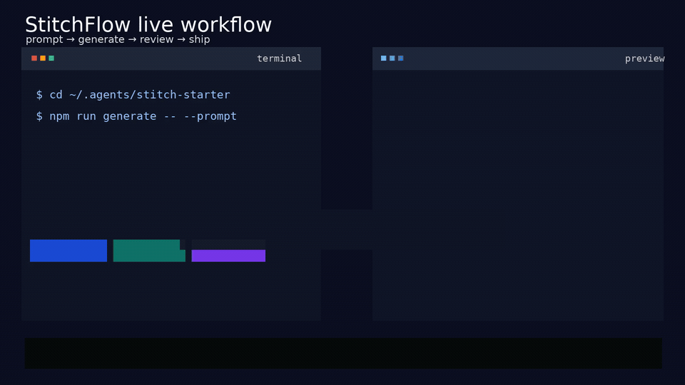
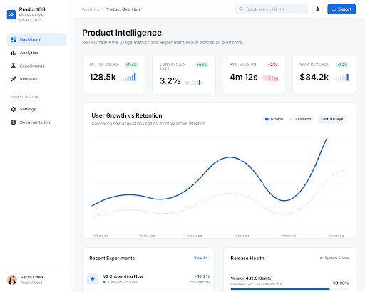

# StitchFlow

[](https://nodejs.org/)
[](https://agentskills.io)
[](https://developers.openai.com/codex/skills)
[](https://code.claude.com/docs/en/slash-commands)
[](https://docs.openclaw.ai/tools/clawhub)
[](https://github.com/github/awesome-copilot)
[](https://google-gemini.github.io/gemini-cli/docs/extensions/)
[](./LICENSE)

> Turn plain-language product briefs into UI directions, Tailwind-friendly HTML, and screenshots in minutes.
>
> Prompt -> UI direction -> local HTML + screenshots.

StitchFlow packages Google Stitch into a **portable local workflow** for:

- Codex
- Claude Code
- OpenClaw
- GitHub Copilot
- Gemini CLI
- other clients that understand `SKILL.md` or `AGENTS.md`

Why people star and keep it:

- generate usable UI directions from plain-language briefs
- save local HTML and screenshots your team can review immediately
- reuse one workflow across multiple coding-agent clients



Live-style workflow demo: prompt → generate → review artifacts.


Short promo demo for StitchFlow.


Square social teaser for Telegram, X, and community posts.



Generated locally from a natural-language prompt with the bundled Stitch workflow.

## What you need before install

- Node.js `>=22`
- a `STITCH_API_KEY`
- one supported client: Codex, Claude Code, OpenClaw, GitHub Copilot, or Gemini CLI

## First result in ~2 minutes

1. clone the repo and run the installer
2. add `STITCH_API_KEY` to your local `.env`
3. restart your agent client
4. run one of the example prompts below
5. open the generated HTML and screenshot artifacts from the local `runs/` folder

## Try these prompts first

```text
Use $stitchflow to generate a premium desktop analytics dashboard for a product team, with a left sidebar, KPI cards, trend charts, and clean Tailwind-ready HTML.
```

```text
Use $stitchflow to explore three mobile-first checkout directions for a modern ecommerce app, with sticky CTA, compact order summary, and polished spacing.
```

```text
Use $stitchflow to create a SaaS landing page for an enterprise design tool, with strong typography, product shots, pricing cards, and a credible B2B feel.
```

Compatibility note:

- brand name: `StitchFlow`
- current skill slug: `stitchflow`
- legacy alias still supported: `stitch-design-local`
- GitHub Copilot plugin slug: `stitchflow`
- Gemini CLI extension id: `stitchflow`

## 60-second setup

```bash
git clone https://github.com/yshishenya/stitchflow.git
cd stitchflow
bash install.sh --target all
```

Then add `STITCH_API_KEY` to:

```text
${STITCH_STARTER_ROOT:-$HOME/.agents/stitch-starter}/.env
```

Then restart your client and run one of the prompts from this README.

Expected first output:
- a generated UI direction
- local HTML you can inspect or share
- a screenshot image saved in the corresponding `runs/` folder

## Who this is for

- product and design engineers who want faster UI exploration before frontend work
- agent builders who want one reusable design workflow across multiple clients
- teams that need local artifacts instead of another hosted black box

## What you get

- one canonical skill: `stitchflow`
- one shared local toolkit: `stitch-starter`
- local HTML, screenshots, and run artifacts
- variants and edits from natural-language prompts
- installable packaging across multiple agent clients

<details open>
<summary><strong>English</strong></summary>

## Why this exists

The Stitch SDK is powerful, but most teams still need a repeatable workflow around it.

This repo removes the friction between:

- a rough product brief
- a useful UI direction
- local artifacts the team can review immediately

StitchFlow packages Stitch as a reusable agent skill, installs a local toolkit, and saves HTML, screenshots, and run metadata on your machine instead of behind another hosted workflow.

## Who this is for

- product engineers who want to explore UI before writing frontend code
- design engineers who want faster prompt-to-HTML loops
- founders who need strong first-pass screens from natural-language briefs
- AI-agent builders who want a ready-to-run Stitch workflow across multiple clients

## What you get

- one canonical skill: `stitchflow`
- one shared local toolkit: `stitch-starter`
- one installer for Codex, Claude Code, OpenClaw, and GitHub Copilot
- local HTML, screenshots, and run artifacts
- one canonical setup under `~/.agents` with compatibility links for native clients

Canonical install paths:

- skill: `${AGENT_SKILLS_HOME:-$HOME/.agents}/skills/stitchflow`
- toolkit: `${STITCH_STARTER_ROOT:-$HOME/.agents/stitch-starter}`

Optional compatibility links:

- `${CODEX_HOME:-$HOME/.codex}/skills/stitchflow`
- `${CLAUDE_HOME:-$HOME/.claude}/skills/stitchflow`
- `${OPENCLAW_HOME:-$HOME/.openclaw}/skills/stitchflow`
- `${COPILOT_HOME:-$HOME/.copilot}/skills/stitchflow`

Legacy alias links remain available after install:

- `${CODEX_HOME:-$HOME/.codex}/skills/stitch-design-local`
- `${CLAUDE_HOME:-$HOME/.claude}/skills/stitch-design-local`
- `${OPENCLAW_HOME:-$HOME/.openclaw}/skills/stitch-design-local`
- `${COPILOT_HOME:-$HOME/.copilot}/skills/stitch-design-local`

Native extension / plugin entrypoints:

- GitHub Copilot: `.github/plugin/plugin.json`
- Gemini CLI: `gemini-extension.json`

## Why not just use the raw SDK?

The raw Stitch SDK is flexible.

This repo is for when you want:

- a ready-to-run local workflow instead of wiring the SDK yourself
- portable skill packaging across multiple agent clients
- HTML, screenshots, and run artifacts saved locally by default

## How to use it

In Codex:

```text
Use $stitchflow to generate a premium desktop dashboard for an internal analytics product.
```

In Claude Code:

```text
/stitchflow landing page for a design tool aimed at enterprise product teams
```

In OpenClaw:

```text
Use the stitchflow skill to explore three mobile-first UI directions for a checkout experience.
```

In GitHub Copilot CLI:

```bash
copilot plugin install yshishenya/stitchflow
```

In Gemini CLI:

```bash
gemini extensions install https://github.com/yshishenya/stitchflow
```

Direct CLI usage:

```bash
cd "${STITCH_STARTER_ROOT:-$HOME/.agents/stitch-starter}"
npm run list
npm run generate -- --prompt "A modern SaaS dashboard with sidebar and stat cards"
npm run edit -- --prompt "Make it more premium and add stronger typography"
npm run variants -- --prompt "Explore three different visual directions" --variant-count 3
```

## Results you can get fast

- explore 3 landing page directions before writing code
- turn a PM brief into HTML and screenshots for review
- iterate on a dashboard without opening Figma
- generate local artifacts a team can review without adopting a new hosted service

Ready-to-use prompt ideas:

- [examples/prompt-recipes.md](./examples/prompt-recipes.md)

If you want to record a demo or launch video:

- [docs/demo-script.md](./docs/demo-script.md)
- [docs/launch-kit.md](./docs/launch-kit.md)
- [docs/catalog-submissions.md](./docs/catalog-submissions.md)
- [docs/launch-system.md](./docs/launch-system.md)
- [docs/community-posts.md](./docs/community-posts.md)

## What gets saved

Outputs go to:

```text
${STITCH_STARTER_ROOT:-$HOME/.agents/stitch-starter}/runs/<timestamp>-<operation>-<slug>/
```

Typical files:

- `result.json` or `variants.json`
- `screen.html`
- `screen.png`, `screen.jpeg`, or `screen.webp`
- `html-url.txt`
- `image-url.txt`

Latest single-screen pointer:

```text
${STITCH_STARTER_ROOT:-$HOME/.agents/stitch-starter}/runs/latest-screen.json
```

## Discovery and trust

- built on Google's [Stitch SDK](https://github.com/google-labs-code/stitch-sdk)
- exports clean HTML and screenshots programmatically
- works across Codex, Claude Code, OpenClaw, GitHub Copilot, and Gemini CLI
- includes [AGENTS.md](./AGENTS.md), [SKILL.md](./skills/stitchflow/SKILL.md), and agent-specific manifests
- licensed under [Apache-2.0](./LICENSE)

## Distribution channels

- official OpenClaw registry path via ClawHub
- official GitHub Copilot plugin install from the repository
- official Gemini CLI extension install from the repository
- community catalog checklist in [docs/catalog-submissions.md](./docs/catalog-submissions.md)

## Contributing

- contribution guide: [CONTRIBUTING.md](./CONTRIBUTING.md)
- toolkit details: [stitch-starter/README.md](./stitch-starter/README.md)

Install it, generate one screen, and ship the best direction into code.

</details>

<details>
<summary><strong>Русский</strong></summary>

## Зачем это нужно

Stitch SDK мощный, но большинству команд нужен не просто SDK, а готовый workflow вокруг него.

Этот репозиторий убирает трение между:

- сырым продуктовым брифом
- первым сильным UI-направлением
- локальными артефактами, которые можно сразу показать команде

StitchFlow упаковывает Stitch в reusable skill для агента, ставит локальный toolkit и сохраняет HTML, скриншоты и run metadata на вашей машине.

## Для кого это

- product engineers, которые хотят исследовать UI до написания фронтенда
- design engineers, которым нужен быстрый prompt-to-HTML цикл
- founders, которым нужны сильные первые экраны из текстового брифа
- builders агентных workflow, которым нужен готовый Stitch setup для нескольких клиентов

## Что вы получаете

- один канонический skill: `stitchflow`
- один локальный toolkit: `stitch-starter`
- один installer для Codex, Claude Code, OpenClaw и GitHub Copilot
- локальные HTML, скриншоты и run artifacts
- каноническую установку в `~/.agents` и compatibility links для нативных клиентов

Канонические пути:

- skill: `${AGENT_SKILLS_HOME:-$HOME/.agents}/skills/stitchflow`
- toolkit: `${STITCH_STARTER_ROOT:-$HOME/.agents/stitch-starter}`

Compatibility links:

- `${CODEX_HOME:-$HOME/.codex}/skills/stitchflow`
- `${CLAUDE_HOME:-$HOME/.claude}/skills/stitchflow`
- `${OPENCLAW_HOME:-$HOME/.openclaw}/skills/stitchflow`
- `${COPILOT_HOME:-$HOME/.copilot}/skills/stitchflow`

Legacy alias links после установки тоже создаются:

- `${CODEX_HOME:-$HOME/.codex}/skills/stitch-design-local`
- `${CLAUDE_HOME:-$HOME/.claude}/skills/stitch-design-local`
- `${OPENCLAW_HOME:-$HOME/.openclaw}/skills/stitch-design-local`
- `${COPILOT_HOME:-$HOME/.copilot}/skills/stitch-design-local`

Нативные entrypoints:

- GitHub Copilot: `.github/plugin/plugin.json`
- Gemini CLI: `gemini-extension.json`

## Почему не просто raw SDK

Raw Stitch SDK гибкий.

Этот репозиторий нужен, когда вы хотите:

- готовый локальный workflow, а не собирать обвязку самому
- переносимую skill-упаковку для нескольких agent clients
- локальные HTML, скриншоты и run artifacts по умолчанию

## Как использовать

Быстрый старт:

```bash
git clone https://github.com/yshishenya/stitchflow.git
cd stitchflow
bash install.sh --target all
```

Потом добавьте `STITCH_API_KEY` в:

```text
${STITCH_STARTER_ROOT:-$HOME/.agents/stitch-starter}/.env
```

И перезапустите клиент.

В Codex:

```text
Use $stitchflow to generate a premium desktop dashboard for an internal analytics product.
```

В Claude Code:

```text
/stitchflow landing page for a design tool aimed at enterprise product teams
```

В OpenClaw:

```text
Use the stitchflow skill to explore three mobile-first UI directions for a checkout experience.
```

В GitHub Copilot CLI:

```bash
copilot plugin install yshishenya/stitchflow
```

В Gemini CLI:

```bash
gemini extensions install https://github.com/yshishenya/stitchflow
```

Через CLI:

```bash
cd "${STITCH_STARTER_ROOT:-$HOME/.agents/stitch-starter}"
npm run list
npm run generate -- --prompt "A modern SaaS dashboard with sidebar and stat cards"
npm run edit -- --prompt "Make it more premium and add stronger typography"
npm run variants -- --prompt "Explore three different visual directions" --variant-count 3
```

## Что можно сделать быстро

- исследовать 3 направления лендинга до написания кода
- превратить PM brief в HTML и скриншоты для ревью
- итерировать dashboard без Figma
- получать локальные артефакты, которые команда может смотреть без нового hosted-сервиса

Готовые prompt ideas:

- [examples/prompt-recipes.md](./examples/prompt-recipes.md)

Для demo и запуска:

- [docs/demo-script.md](./docs/demo-script.md)
- [docs/launch-kit.md](./docs/launch-kit.md)
- [docs/catalog-submissions.md](./docs/catalog-submissions.md)

## Что сохраняется

Все результаты попадают в:

```text
${STITCH_STARTER_ROOT:-$HOME/.agents/stitch-starter}/runs/<timestamp>-<operation>-<slug>/
```

Обычно внутри:

- `result.json` или `variants.json`
- `screen.html`
- `screen.png`, `screen.jpeg` или `screen.webp`
- `html-url.txt`
- `image-url.txt`

Указатель на последний single-screen run:

```text
${STITCH_STARTER_ROOT:-$HOME/.agents/stitch-starter}/runs/latest-screen.json
```

## Доверие и discoverability

- построен на [Google Stitch SDK](https://github.com/google-labs-code/stitch-sdk)
- программно экспортирует HTML и screenshots
- работает в Codex, Claude Code, OpenClaw, GitHub Copilot и Gemini CLI
- содержит [AGENTS.md](./AGENTS.md), [SKILL.md](./skills/stitchflow/SKILL.md) и platform manifests
- лицензия: [Apache-2.0](./LICENSE)

## Каналы дистрибуции

- официальный реестр OpenClaw через ClawHub
- официальный install GitHub Copilot plugin прямо из репозитория
- официальный install Gemini CLI extension прямо из репозитория
- чеклист по каталогам в [docs/catalog-submissions.md](./docs/catalog-submissions.md)

## Контрибьютинг

- гайд: [CONTRIBUTING.md](./CONTRIBUTING.md)
- toolkit details: [stitch-starter/README.md](./stitch-starter/README.md)

Установите, сгенерируйте один экран и протащите лучший вариант в код.

</details>
